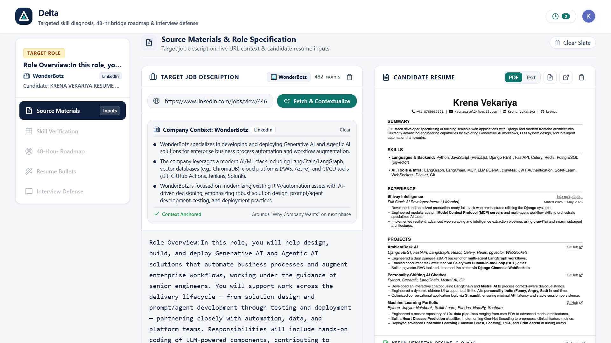
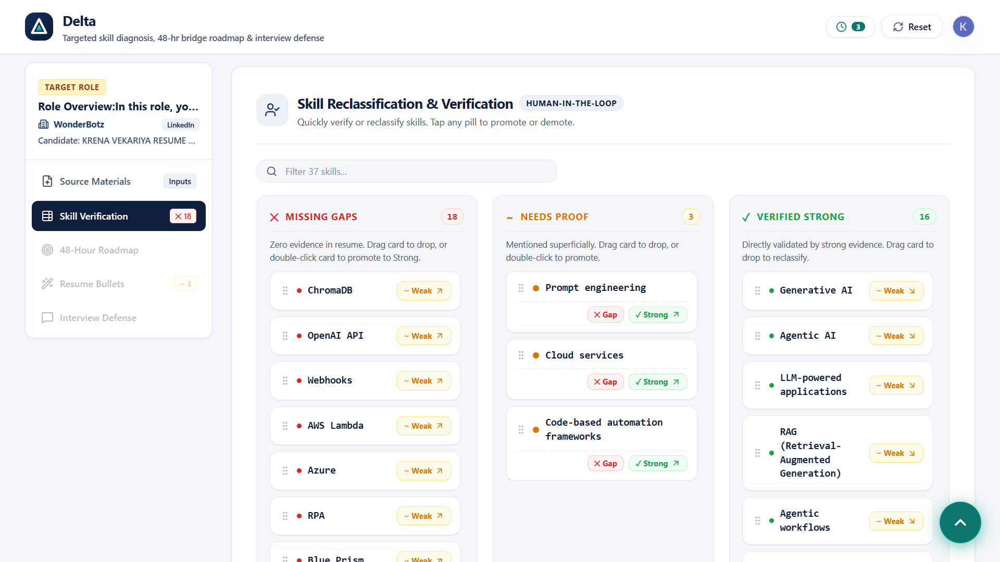
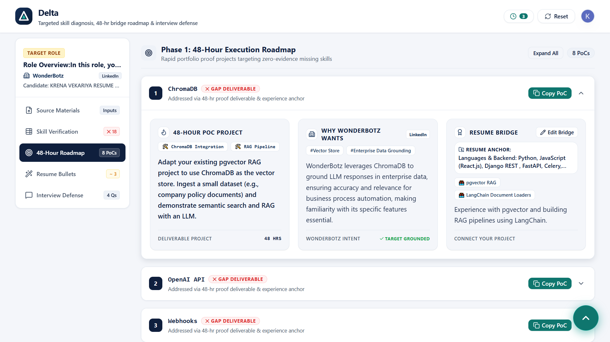
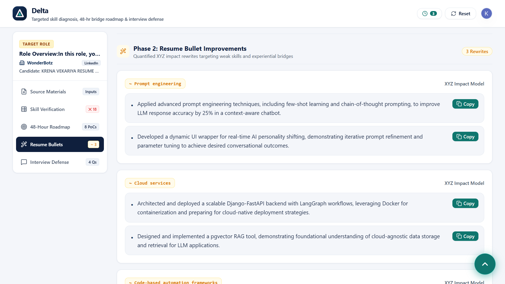
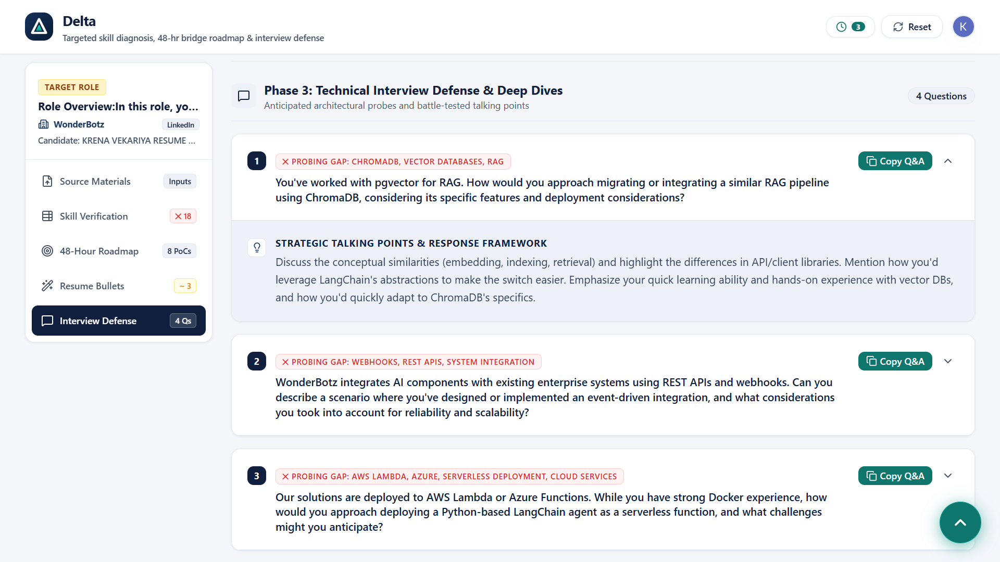
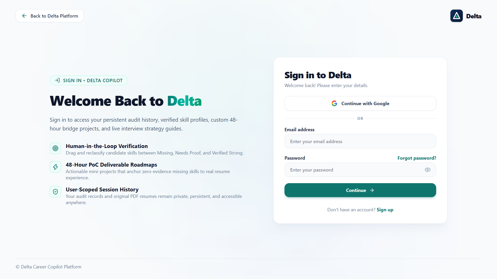
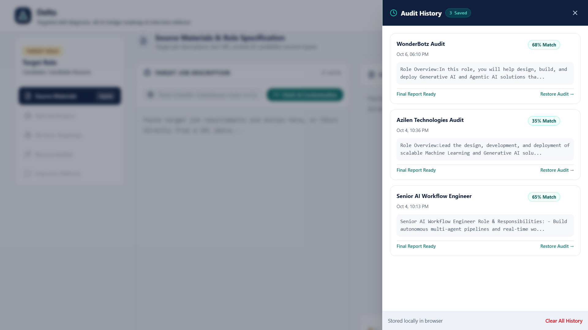

# Delta — Resume Gap Analysis & Career Copilot

> An Agentic AI application powered by **LangGraph**, **FastAPI**, **Next.js**, and **Supabase** that automates ATS-grade job description analysis, candidate resume verification, Human-in-the-Loop (HITL) skill classification, and 48-hour proof-of-concept project roadmapping.

[](https://nextjs.org/)
[](https://fastapi.tiangolo.com/)
[](https://langchain-ai.github.io/langgraph/)
[](https://clerk.com/)
[](LICENSE)

---

## Screenshots

| 1. Input & Job Extraction | 2. Human-in-the-Loop Verification |
| :---: | :---: |
|  |  |

| 3. Strategic Readiness Score & Insights | 4. 48-Hour PoC Project Roadmap |
| :---: | :---: |
|  |  |

| 5. Technical Interview Defense Guide | 6. Light Theme Authentication |
| :---: | :---: |
|  |  |

| 7. Persistent Audit History Vault | |
| :---: | :---: |
|  | |

---

## Key Features

- **Universal Custom Scrollbar**: Slim, hidden-scrollbar interface across containers, drawers, modals, and textareas.
- **Automated Job URL Extraction**: Paste any job posting URL (LinkedIn, Greenhouse, Lever, company career pages) to automatically extract company context, tech stack, and role requirements.
- **Resume PDF & Text Ingestion**: Drag and drop `.pdf`, `.txt`, or `.md` resumes with client-side PDF rendering.
- **LangGraph State Machine Workflow**:
  - **Entity Extraction**: Structured technical skill entity recognition.
  - **ATS Gap Classifier**: Categorizes required skills into **Missing**, **Needs Proof**, and **Verified Strong**.
  - **Human-in-the-Loop Interrupt (`interrupt()`)**: Execution pauses for candidate verification and drag-and-drop skill reclassification before finalizing analysis.
  - **Strategic Tier 1 Insights**: Computes Strategic Match Score (0-100%), Executive Summary, 48-Hour PoC Project Roadmaps, Resume Bullet Upgrades, and Technical Interview Defense Questions.
- **User-Scoped Auth & Audit Vault**: Persistent, private audit history tied to authenticated user accounts via Clerk & Supabase.

---

## Repository Structure

```
job-agent/
├── backend/                  # Python FastAPI & LangGraph AI Backend
│   ├── src/                  # Application source code
│   │   ├── api/              # FastAPI router endpoints & HTTP schemas
│   │   ├── core/             # AI workflow engine, state schemas & LLM clients
│   │   └── services/         # Web scraper & domain knowledge base
│   ├── main.py               # Uvicorn entrypoint
│   ├── requirements.txt      # Python dependencies
│   └── run_pipeline.py       # LangGraph CLI pipeline test runner
├── frontend/                 # Next.js 15 App Router Frontend
│   ├── src/                  # Source code
│   │   ├── app/              # Next.js App Router pages (layout, globals.css, auth)
│   │   ├── components/       # Reusable UI components & PDF viewer
│   │   ├── utils/            # Heartbeat & helper hooks
│   │   └── middleware.ts     # Next.js authentication middleware
│   ├── public/               # Static icons, PDF worker, and screenshots
│   │   └── screenshots/      # Screenshot image directory
│   ├── package.json          # Node dependencies
│   └── tsconfig.json         # TypeScript compiler configuration
└── README.md                 # Project documentation
```

---

## Tech Stack

- **AI Engine**: LangGraph (`StateGraph` + `MemorySaver` checkpointer)
- **LLM Providers**: Groq (primary) with Google Gemini fallback mechanisms
- **Backend Infrastructure**: FastAPI, Pydantic v2, `pypdf`, `httpx`, `beautifulsoup4`
- **Frontend Infrastructure**: Next.js (App Router), React 19, TypeScript, Tailwind CSS, Lucide Icons, Clerk Auth

---

## Getting Started

### 1. Backend Setup

```bash
# 1. Navigate to the backend directory
cd backend

# 2. Configure environment variables in backend/.env:
# GROQ_API_KEY=your_groq_api_key
# GOOGLE_API_KEY=your_google_gemini_api_key

# 3. Start FastAPI Backend Server
python -m uvicorn main:app --reload --port 8000
```
Interactive API documentation: `http://localhost:8000/docs`

### 2. Frontend Setup

```bash
# 1. Navigate to the frontend directory
cd frontend

# 2. Install Node dependencies
npm install

# 3. Start Next.js Development Server
npm run dev
```
Frontend application: `http://localhost:3000`

---

## License

MIT
